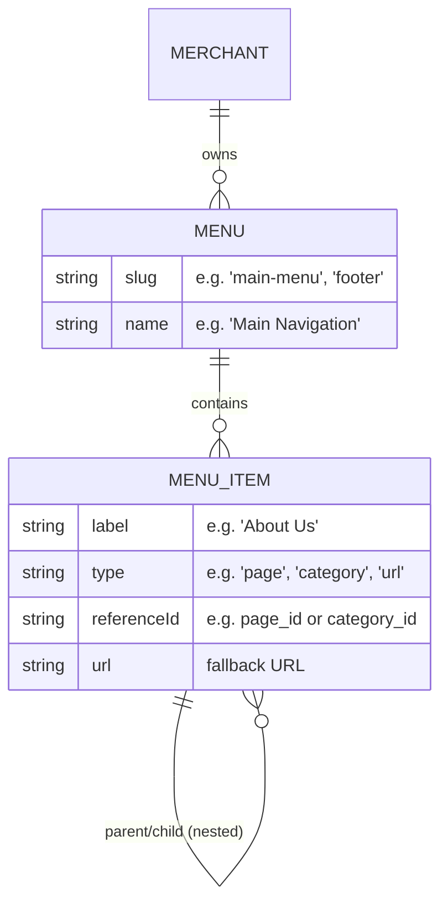

# Exploring Storefront Navigation

You've highlighted a critical gap: **CMS pages are currently orphaned.** While a merchant can create a page like `/pages/about-us`, there is no way for a customer to discover it unless the merchant manually links to it somewhere, but right now our templates (`Fashion`, `General`) have **hardcoded navigation links**!

For example, the Fashion template's footer currently looks like this in the code:
```tsx
<ul className="flex flex-col gap-3 text-xs">
  <li><a href="#">Our Story</a></li>
  <li><a href="#">Careers</a></li>
  <li><a href="#">Sustainability</a></li>
</ul>
```

To fix this, we need to introduce a dynamic navigation system. Here are the industry-standard ways to solve this, ranging from simple to advanced.

---

## Option 1: Extend Storefront Layout (Simple & Fast)
We extend the existing `storefrontLayout` JSON column on the `merchants` table to include arrays for header and footer links.

**How it works:**
The merchant goes to **Settings > Storefront** and uses a simple repeatable field (like the FAQ builder) to add links to the Header and Footer.

```json
{
  "headerLinks": [
    { "label": "Shop", "url": "/products" },
    { "label": "About Us", "url": "/pages/about-us" }
  ],
  "footerLinks": [
    { "label": "Shipping Policy", "url": "/pages/shipping" },
    { "label": "Returns", "url": "/pages/returns" }
  ]
}
```

**Pros:** 
- Extremely fast to build.
- Piggybacks on our existing `storefrontLayoutSchema` and settings page.
**Cons:**
- Flat structure only (no dropdown menus).
- Layout specific (tied to the JSON config rather than being a core CMS entity).

---

## Option 2: Core Navigation Entities (The Shopify Way)
We introduce standard `menus` and `menu_items` tables to the database. This allows for reusable, nested navigation structures.



**How it works:**
1. A new **Navigation** section is added to the Dashboard under Storefront.
2. Merchants create a "Main Menu" and add items to it.
3. When linking an item, they select the type: *Page, Category, Product, or Custom Link*.
4. Templates query `getMenuBySlug("main-menu")` and render the items dynamically.

**Pros:**
- Highly scalable and flexible.
- Supports nested dropdown menus.
- "Smart" links: If a linked page changes its slug, the navigation doesn't break because it references the Page ID.
**Cons:**
- Requires database migrations and new UI components (drag-and-drop builders can be complex).

---

## Option 3: Auto-Discovery (The Zero-Config Way)
We automatically inject all "Published" standard pages into the Footer, and keep the Header restricted to core e-commerce links (Shop, Categories, Orders).

**How it works:**
When rendering the Footer, we query all published `pages` for that merchant and map them into a "Company" or "Legal" list automatically.

**Pros:**
- Zero configuration required from the merchant.
- Pages appear immediately upon publishing.
**Cons:**
- Zero control for the merchant (they can't reorder links, hide specific pages from the footer, or put them in the header).

---

### My Recommendation

If we want to build a truly robust platform, **Option 2 (Core Navigation Entities)** is the industry standard (Shopify, WordPress, BigCommerce all do this). 
However, if we are trying to keep this specific feature iteration lean, **Option 1 (Extend Storefront Layout)** is a pragmatic stepping stone that gives merchants control without requiring complex nested tree UI builders.

What do you think? Should we capture one of these approaches in a new Change Proposal?
