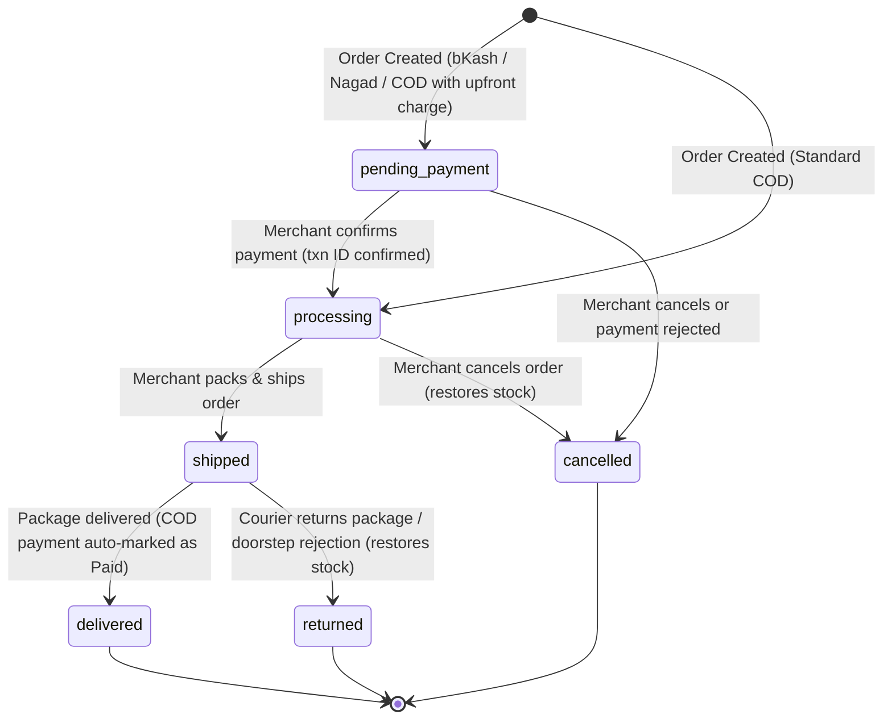

# Data Model Design: Cash on Delivery (COD) Checkout Integration

This document defines the schema changes, validation rules, and lifecycle transitions for the Cash on Delivery (COD) feature.

## 1. Schema Changes

### `merchants` Table Extensions
We will add two new fields to support merchant configuration of Cash on Delivery payment options.

| Field Name | DB Column Name | Type | Constraints | Default | Description |
| :--- | :--- | :--- | :--- | :--- | :--- |
| `codEnabled` | `cod_enabled` | `boolean` | `notNull` | `false` | Indicates if Cash on Delivery is active on the storefront. |
| `payDeliveryChargeFirst` | `pay_delivery_charge_first` | `boolean` | `notNull` | `false` | Indicates if customers must pay the delivery charge upfront via bKash/Nagad. |
| `bkashWalletNumber` | `bkash_wallet_number` | `varchar(15)` | `null` | `null` | Merchant's bKash personal account number for upfront shipping collection. |
| `nagadWalletNumber` | `nagad_wallet_number` | `varchar(15)` | `null` | `null` | Merchant's Nagad personal account number for upfront shipping collection. |

### `orders` Table Extensions
The `status` field transitions will be extended. No new columns are needed, but validation will accept `returned` as a valid state.

* **Status Values**: `pending_payment` | `processing` | `shipped` | `delivered` | `cancelled` | `returned` (new)

### `payment_confirmations` Table Extensions
The `paymentMethod` field values will be extended to accept `"cod"`.
- **paymentMethod Values**: `bkash` | `nagad` | `cod` (new)
- **transactionId Values**: A string representing the transaction ID (for bkash/nagad) or `"COD"` (for standard COD).

---

## 2. Validation & Business Rules

### Merchant Settings Validation
- `storeSettingsSchema` in `lib/validations/settings.ts` will be updated:
  ```typescript
  codEnabled: z.boolean().default(false),
  payDeliveryChargeFirst: z.boolean().default(false),
  ```
- **Plan Rule**: If `plan.features.cod` is `false`, the database will reject any updates setting `codEnabled` or `payDeliveryChargeFirst` to `true`.

### Checkout Payment Validation
- `paymentSchema` in `lib/validations/checkout.ts` will validate the selected payment method and transaction ID:
  ```typescript
  export const paymentSchema = z.discriminatedUnion("paymentMethod", [
    z.object({
      paymentMethod: z.enum(["bkash", "nagad"] as const),
      transactionId: z.string().min(6, "Enter the transaction ID from your bKash/Nagad app"),
    }),
    z.object({
      paymentMethod: z.literal("cod"),
      transactionId: z.string().optional(),
    })
  ])
  ```

---

## 3. Order Status State Machine

The following diagram defines the allowed transitions for order statuses, highlighting the new `returned` status and the different entry points for COD orders.


